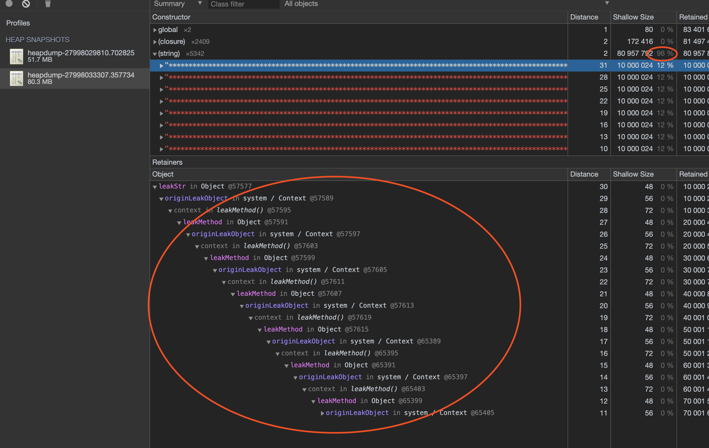

# nodejs调试指南

## cpu

### perf, FlameGraph

#### 火焰图

`perf`是`Linux Kernal`自带性能分析工具。它是基于内核源码的一些`hook`——`Tracepoint`, 能进行函数级与指令级的热点查找。centos系统直接`yum install -y perf`进行安装。

我们node运行`node --perf_basic_prof app.js &`(加&会进入后台运行)，会在`/tmp/`下生产一个`perf-#{id}.map`的文件。

```bash
e3a46ee95b2 22 LazyCompile:~listenerCount events.js:489
e3a46ee974a f LazyCompile:~createServer http.js:33
e3a46ee9902 7b LazyCompile:~Server _http_server.js:264
e3a46ee9f82 16e LazyCompile:~Server net.js:1212
e3a46eeab72 235 LazyCompile:~Server.listen net.js:1440
e3a46eeb4d2 c4 LazyCompile:~normalizeArgs net.js:127
e3a46eeb85a 16 LazyCompile:~isPipeName net.js:82
e3a46eeba22 18 LazyCompile:~toNumber net.js:1261
e3a46eebbaa 4b LazyCompile:~isLegalPort internal/net.js:5
e3a46eebf92 b3 LazyCompile:~listenInCluster net.js:1398
e3a46eec51a 8 Script:~ cluster.js:1
...
```

每行信息都为3列，分别为16进制的符号地址、大小、符号名。注意参数`--perf_basic_prof`会使map内容增加，可使用`--perf_basic_prof_only_functions`，不过会导致火焰图不全。

`FlameGraph`是用于生成火焰图的工具。

我们首先获取运行的`node`进程——`ps -ef | grep node`。新开shell进行压测`$ ab -k -c 10 -n 2000 "http://localhost:3000/auth?username=admin&password=123456"`。同时，我们在另外一个shell根据node的进程采集信息——`perf record -F 99 -p 20316`。采集的信息生成`perf.data`文件。

执行`perf script > perf.stacks`生成`perf.stacks`。

执行`~/FlameGraph/stackcollapse-perf.pl --kernel < /tmp/perf.stacks | ~/FlameGraph/flamegraph.pl --color=js --hash> /tmp/flamegraph.svg`生成svg文件。


1，每一块代表一个函数

2，Y轴代表函数栈的深度，top代表占据cpu的函数。

3，x轴仅代表字母顺序。但是函数块的宽度代表占用cpu的时间。越宽代表使用cpu约长或者频繁。

4，多线程取样可能会超过运行时间。

上图可以看出`node::crypto::PBKDF2`占用时间比较多。如果我们在代码中把同步改为异步重新生成火焰图。


可以看到js代码中的宽度块所占宽度大大减少，同时多了一个`node:BackroundRunner`，是采用线程池异步执行来优化了性能。


#### 红蓝差火焰图

是基于优化前后的profile文件进行展示。如果优化后出现的次数多则为红色，否则为蓝色。

在代码修改前后分别执行：

```
perf record -F 99 -p <PID> -g -- sleep 30

perf script > perf_before.stacks
```

然后生成差分火焰图

```
~/FlameGraph/stackcollapse-perf.pl ~/perf_before.stacks > perf_before.folded
~/FlameGraph/stackcollapse-perf.pl ~/perf_after.stacks > perf_after.folded
~/FlameGraph/difffolded.pl perf_before.folded perf_after.folded | ~/FlameGraph/flamegraph.pl > flamegraph_diff.svg
```


如果出现次数变少，则会是蓝色，就会造成一个问题就是如果优化后不再执行，那么就完全不没有蓝色显示。此时需要反差差分火焰图。

```
./FlameGraph/difffolded.pl perf_after.folded perf_before.folded | ./FlameGraph/flamegraph.pl --negate > flamegraph_diff2.svg
```


`flamegraph_diff`表示已修改前为基础，`flamegraph_diff2`表示已修改后为基准。`--negate`用于颠倒红蓝配色。

差分火焰图适合代码变化不大的情况。

### v8-profiler

`v8-profiler`是C++模块，可以分析cpu使用时的情况。

```javaScript
app.route({ method: 'GET', path: '/cpuprofile', async controller (ctx) {
   //Start Profiling
   profiler.startProfiling('CPU profile')
   await Bluebird.delay(30000)
   //Stop Profiling after 30s
   const profile = profiler.stopProfiling()
   profile.export()
     .pipe(fs.createWriteStream(`cpuprofile-${Date.now()}.cpuprofile`))
     .on('finish', () => profile.delete())
   ctx.status = 204
}})
```

在程序执行时，触发`profile`，生成记录文件。关于文件的解读有两种方式。

#### Chrome DevTools

使用chrome->devtool->moretools->javascript profile->load。

1, chart: 按照时间顺序排列的火焰图

2，heavy: 按照性能影响排列。百分比为占用cpu使用时间的百分比。

3，tree：调用结构显示。

#### flamegraph

使用`npm i flamegraph -g`安装`flamegraph`。使用`flamegraph -t cpuprofile -f cpuprofile-xxx.cpuprofile -o cpuprofile.svg`来生成对应的火焰图。

#### v8-analytics

全局安装`v8-analytics`。具有三个功能：

1，将v8引擎优化失败的函数标红展示

2，标注执行时长超预期的函数

3，标注可疑内存泄漏点。

执行命令：`va timeout cpuprofile-1576726398389.cpuprofile 200 --only`，超过200ms执行的函数：

```
1. (idle) (2.83s 9.43%)
2. parserOnHeadersComplete (254.0ms 0.85%) (_http_common.js 61)
3. parserOnIncoming (254.0ms 100.00%) (_http_server.js 562)
4. emit (254.0ms 100.00%) (events.js 156)
5. emitTwo (254.0ms 100.00%) (events.js 124)
6. handleRequest (254.0ms 100.00%) (/srv/test/node_modules/koa/lib/application.js 131)
7. handleRequest (254.0ms 100.00%) (/srv/test/node_modules/koa/lib/application.js 145)
...
```

可疑定位到问题函数。

### Tick Processor

V8内置了`Tick Processor`性能分析工具，默认情况下是关闭的，可以通过`--prof`来开启。

```node --prof app```

会在目录下生成`isolate-xx-v8log`文件。执行`node --prof-process isolate-xx.log`:

```
Shared libraries]:
   ticks  total  nonlib   name

 [JavaScript]:
   ticks  total  nonlib   name
      1    0.1%    0.1%  LazyCompile: ~hash /srv/test/test.js:3:15
      1    0.1%    0.1%  LazyCompile: ~debuglog util.js:262:18
      1    0.1%    0.1%  Builtin: StoreICStrict_Uninitialized
      1    0.1%    0.1%  Builtin: Construct {1}
      1    0.1%    0.1%  Builtin: Call_ReceiverIsAny

 [C++]:
   ticks  total  nonlib   name
   1144   93.0%   93.0%  node::crypto::PBKDF2(v8::FunctionCallbackInfo<v8::Value> const&)
     27    2.2%    2.2%  node::(anonymous namespace)::ContextifyScript::New(v8::FunctionCallbackInfo<v8::Value> const&)
      4    0.3%    0.3%  node::Binding(v8::FunctionCallbackInfo<v8::Value> const&)
      4    0.3%    0.3%  __memmove_ssse3_back
      3    0.2%    0.2%  _int_malloc
      1    0.1%    0.1%  void std::vector<v8::internal::Handle<v8::internal::Map>, std::allocator<v8::internal::Handle<v8::internal::Map> > >::_M_emplace_back_aux<v8::internal::Handle<v8::internal::Map> const&>(v8::internal::Handle<v8::internal::Map> const&)
      1    0.1%    0.1%  v8::internal::interpreter::ConstantArrayBuilder::ConstantArrayBuilder(v8::internal::Zone*)
      1    0.1%    0.1%  v8::internal::interpreter::BytecodeGenerator::GenerateBytecodeBody()
      1    0.1%    0.1%  v8::internal::interpreter::BytecodeArrayBuilder::CountOperation(v8::internal::Token::Value, int)
      1    0.1%    0.1%  v8::internal::compiler::ConstraintBuilder::MeetConstraintsBefore(int)
      1    0.1%    0.1%  v8::internal::Zone::New(unsigned long)
      1    0.1%    0.1%  v8::internal::Scope::ContextChainLength(v8::internal::Scope*) const
      1    0.1%    0.1%  v8::internal::Scanner::ScanIdentifierOrKeyword()
      1    0.1%    0.1%  v8::internal::ParserBase<v8::internal::Parser>::ParseExpressionCoverGrammar(bool, bool*)
      1    0.1%    0.1%  v8::internal::PagedSpace::AddPage(v8::internal::Page*)
      1    0.1%    0.1%  v8::internal::Map::TransitionToDataProperty(v8::internal::Handle<v8::internal::Map>, v8::internal::Handle<v8::internal::Name>, v8::internal::Handle<v8::internal::Object>, v8::internal::PropertyAttributes, v8::internal::PropertyConstness, v8::internal::Object::StoreFromKeyed, bool*)
      1    0.1%    0.1%  v8::internal::Map::CopyDropDescriptors(v8::internal::Handle<v8::internal::Map>)
      1    0.1%    0.1%  v8::internal::Logger::LogCompiledFunctions()
      1    0.1%    0.1%  v8::internal::Log::MessageBuilder::Append(char const*, ...)
      1    0.1%    0.1%  v8::internal::LayoutDescriptor::New(v8::internal::Handle<v8::internal::Map>, v8::internal::Handle<v8::internal::DescriptorArray>, int)
      1    0.1%    0.1%  v8::internal::HashTable<v8::internal::StringTable, v8::internal::StringTableShape>::Rehash()
      1    0.1%    0.1%  v8::internal::Deserializer::ReadData(v8::internal::Object**, v8::internal::Object**, int, unsigned char*)
      1    0.1%    0.1%  v8::internal::Deserializer::GetBackReferencedObject(int)
      1    0.1%    0.1%  v8::internal::DescriptorArray::Sort()
      1    0.1%    0.1%  v8::internal::CompilationInfo::CompilationInfo(v8::internal::Zone*, v8::internal::Isolate*, v8::internal::ParseInfo*, v8::internal::FunctionLiteral*)
      1    0.1%    0.1%  v8::internal::AstValueFactory::GetString(unsigned int, bool, v8::internal::Vector<unsigned char const>)
      1    0.1%    0.1%  v8::internal::AstValueFactory::GetOneByteStringInternal(v8::internal::Vector<unsigned char const>)
      1    0.1%    0.1%  v8::internal::AstNumberingVisitor::VisitNoStackOverflowCheck(v8::internal::AstNode*)
      1    0.1%    0.1%  v8::base::TemplateHashMapImpl<void*, void*, v8::base::HashEqualityThenKeyMatcher<void*, bool (*)(void*, void*)>, v8::base::DefaultAllocationPolicy>::Resize(v8::base::DefaultAllocationPolicy) [clone .isra.50]
      1    0.1%    0.1%  operator delete(void*)
      1    0.1%    0.1%  int v8::internal::BinarySearch<(v8::internal::SearchMode)1, v8::internal::DescriptorArray>(v8::internal::DescriptorArray*, v8::internal::Name*, int, int*)
      1    0.1%    0.1%  do_futex_wait.constprop.1
      1    0.1%    0.1%  _dl_lookup_symbol_x
      1    0.1%    0.1%  __GI__IO_vfprintf
      1    0.1%    0.1%  _IO_str_init_static_internal

 [Summary]:
   ticks  total  nonlib   name
      5    0.4%    0.4%  JavaScript
   1212   98.5%   98.5%  C++
      3    0.2%    0.2%  GC
      0    0.0%          Shared libraries
     13    1.1%          Unaccounted

 [C++ entry points]:
   ticks    cpp   total   name
   1175   98.1%   95.5%  v8::internal::Builtin_HandleApiCall(int, v8::internal::Object**, v8::internal::Isolate*)
     15    1.3%    1.2%  v8::internal::Runtime_CompileLazy(int, v8::internal::Object**, v8::internal::Isolate*)
      2    0.2%    0.2%  v8::internal::Runtime_KeyedStoreIC_Miss(int, v8::internal::Object**, v8::internal::Isolate*)
      1    0.1%    0.1%  v8::internal::Runtime_ToFastProperties(int, v8::internal::Object**, v8::internal::Isolate*)
      1    0.1%    0.1%  v8::internal::Runtime_StoreIC_Miss(int, v8::internal::Object**, v8::internal::Isolate*)
      1    0.1%    0.1%  v8::internal::Runtime_NewObject(int, v8::internal::Object**, v8::internal::Isolate*)
      1    0.1%    0.1%  v8::internal::Runtime_LoadIC_Miss(int, v8::internal::Object**, v8::internal::Isolate*)
      1    0.1%    0.1%  v8::internal::Runtime_CreateObjectLiteral(int, v8::internal::Object**, v8::internal::Isolate*)
      1    0.1%    0.1%  v8::internal::Log::MessageBuilder::Append(char const*, ...)

 [Bottom up (heavy) profile]:
  Note: percentage shows a share of a particular caller in the total
  amount of its parent calls.
  Callers occupying less than 1.0% are not shown.

   ticks parent  name
   1144   93.0%  node::crypto::PBKDF2(v8::FunctionCallbackInfo<v8::Value> const&)
   1144  100.0%    v8::internal::Builtin_HandleApiCall(int, v8::internal::Object**, v8::internal::Isolate*)
   1144  100.0%      LazyCompile: ~pbkdf2 crypto.js:691:16
   1144  100.0%        LazyCompile: ~exports.pbkdf2Sync crypto.js:686:30
   1144  100.0%          LazyCompile: ~hash /srv/test/test.js:3:15
   1144  100.0%            Script: ~<anonymous> /srv/test/test.js:1:11

     27    2.2%  node::(anonymous namespace)::ContextifyScript::New(v8::FunctionCallbackInfo<v8::Value> const&)
     27  100.0%    v8::internal::Builtin_HandleApiCall(int, v8::internal::Object**, v8::internal::Isolate*)
     27  100.0%      LazyCompile: ~runInThisContext bootstrap_node.js:496:28
     27  100.0%        LazyCompile: ~NativeModule.compile bootstrap_node.js:585:44
     27  100.0%          LazyCompile: ~NativeModule.require bootstrap_node.js:517:34
      6   22.2%            Script: ~<anonymous> module.js:1:11
      4   14.8%            Script: ~<anonymous> util.js:1:11
      3   11.1%            Script: ~<anonymous> tty.js:1:11
      2    7.4%            LazyCompile: ~setupGlobalVariables bootstrap_node.js:252:32
      2    7.4%            LazyCompile: ~setupGlobalConsole bootstrap_node.js:307:30
      1    3.7%            Script: ~<anonymous> stream.js:1:11
      1    3.7%            Script: ~<anonymous> readline.js:1:11
      1    3.7%            Script: ~<anonymous> net.js:1:11
      1    3.7%            Script: ~<anonymous> internal/url.js:1:11
      1    3.7%            Script: ~<anonymous> internal/trace_events_async_hooks.js:1:11
      1    3.7%            Script: ~<anonymous> internal/loader/ModuleRequest.js:1:11
      1    3.7%            Script: ~<anonymous> fs.js:1:11
      1    3.7%            Script: ~<anonymous> _stream_readable.js:1:11
      1    3.7%            LazyCompile: ~setupNextTick internal/process/next_tick.js:49:23
      1    3.7%            LazyCompile: ~Module._load module.js:448:24

     13    1.1%  UNKNOWN
```

`JavaScript`表示js代码执行所占的cpu时钟周期，`C++`表示C++所占cpu时钟周期。`Summary`列出各部分占比，`Bottom up`如devtool一样，表示cpu占用时间从大到校的函数及对战信息。

另外还有可以使用[v8](https://github.com/v8/v8)的`v8/tools/profview/index.html`页面来ui化。

---

## 内存

### Core & Core Dump

`Core`表示记忆体，`Core Dump`是程序异常终止和崩溃，操作系统把当时的内存状态记录下来，保存一个文件中——内存快照。包括内存信息、寄存器信息、操作系统状态信息。

`gcore`可以不重启程序而dump特定进程的`core`文件——`gcore [-o filename] file`。

// 需要安装 llnode


### heapdump

`heapdump`是`dump V8`堆信息的工具。可以用于分析内存泄漏, 在运营程序代码时，执行`kill -USR2 'pgrep -n node'`平滑重启，在重启过程中生成两个`heapsnapshot`文件。

使用`chrome Devtools->memory->load`，<strong>按顺序依次加载</strong>生成的`heapsnapshot`。关于堆快照，有4个选项：

1，`Summary`以构造函数名分类显示

2，`Comparison`比较快照间的差异

3，`Containment`查看GC路径

4，`Statistics` 查看内存占用信息

在`Summary`选项中，`Contructor`是构造函数，`Distance`是到GC根对象的距离，`Objects count`是对象个数，`Shallow Size`是对象自身的大小，不包括引用的对象，`Retained Size`是自身大小与引用对象的大小，也是GC之后能回收的内存大小。



根据上述代码，可以看到闭包问题：`originLeakObject/leakObject`。

也可以选择`Comparison`来看前后两个快照的对比。

### memwatch-next

`memwatch-next`模块是可以观测发现内存泄漏的一个模块。`memwatch`可以监听`stats`（每次GC会触发）、`leak`（可疑内存泄漏，触发条件内存5次GC都是增长的）

`memwatch-next`最好与`heapdump`结合使用——在进程开始时，输出一次快照，在监听到`leak`时输出一个快照。通过`devtool`来定位。

我们通过`node --expose-gc app.js`来启动程序，可以手动触发GC——`global.gc()`.


### cpu-memory-monitor

`cpu-memory-monitor`可以配置策略自动dump内存与cpu的情况。

```javaScript
require('cpu-memory-monitor')({
  cpu: {
    interval: 1000,
    duration: 30000,
    threshold: 60,
    profileDir: '/tmp',
    counter: 3,
    limiter: [5, 'hour']
  }
})
```

1000ms监测一次，连续三次cpu使用率大于60%，则dump30s的cpu得使用情况。1小时最多dump5次。以上是监测cpu, 监测memory类似。
