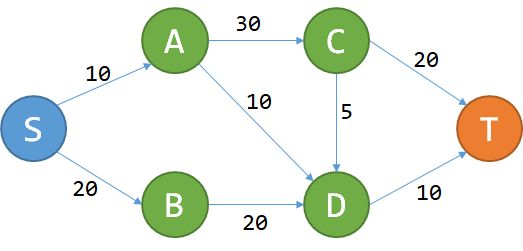

# 动态规划

### 定义：

> 求某种最优解的问题，要把问题分为若干子问题，先求解子问题，再从子问题获得原问题的解答。与分治算法的区别是，子问题往往不是独立的（下一阶段子问题的求解是上一阶段解的基础，这个也是与分治算法最大区别），并且已解决子问题的答案会被保存，被用于后续计算。

什么情况下可以使用动态规划呢？

> “从目标函数入手，分析影响目标函数的几个变量，朝着优化方向，调整这几个变量，重新计算目标函数值。得到最优解。”

一般两种实现方法：

> 1. 使用内存自顶向下，保存子问题结果，然后求某个子问题时，若用到某个结果直接返回。

> 2. 求某个子问题，会依赖于某个更小的子问题。

### 特点：

> 1.最优化原理。子策略都是最优解的。

> 2.无后有效性。前各个阶段的状态无法影响未来的决策。

> 3.重叠性。空间复杂度比较大些。

### 应用：

##### 简单

比如"斐波那契额数列"、“爬台阶问题”

> 爬台阶问题： 一座高为10级台阶的楼梯，从下往上走，每次只能跨越1级或者2级，求n级台阶有多少种走法。

在第N阶台阶前，一定会走到N-1阶或者N-2台阶。所以第N阶的走法等于N-1的走法加上N-2的走法。

最直接的方法就是递归：

```javascript
function getStep(n) {
    if ( n < 1) {
        return 0
    } else if (n === 1) {
        return 1
    } else if (n === 2) {
        return 2
    } else {
        return getStep(n - 1) + getStep(n - 2)
    }
}
```
但是它的复杂度为O(2^n)。

使用动态规划的话，我们就要保存某一台阶的计算值，然后给后子问题（台阶）的计算提供帮助。

````javascript
// n 是台阶总数
function getStep(n) {
    if ( n < 1) {
        return 0
    } else if (n === 1) {
        return 1
    } else if (n === 2) {
        return 2
    } else {
        let f1 = 1
        let f2 = 2
        let fn = 0
        for (let i = 3; i <= n; i++) {
            fn = f1 + f2
            f1 = f2
            f2 = fn
        }
        return fn
    }
}
````

> 《container with most water》 求数组中两个索引之间的距离乘以两者赌赢高度的较小值，取这个目标函数的最大值。

目标函数：`Max((j - i) * Min(h(i), h(j)))`。条件：`i < j, i >=0, j <= n-1`

如果暴力求解的话复杂度为O(n^2)。其方法就是，每次锁定i时，循环j。得出此i的最大面积后，然后循环i。

因此，在x轴尽可能大的情况下，只需要注意h(j) > h(i)的话，此时i的面积为（j-i）* h(i)，因为h(i) < h(j)，所以就i往右移动一位。因为i与i与j之前任何一个值的面积都小于（j-i）* h(i)。同理j小也一样。

```javascript
function maxArea(height) {
    let i = 0
    let j = height.length - 1
    let maxarea = (j - i) * Math.min(height[i], height[j])
    while(i <= j) {
        maxarea = Math.max((j - i) * Math.min(height[i], height[j]), maxarea)
        if (height[i] <= height[j]) {
            i++
        } else {
            j--
        }
    }
    return maxarea
}
```
> 最长上升自序列(LIS). 有一串序列，要求找出它的一串子序列，这串子序列可以不连续。但必须满足它是严格的单调递増的且为最长的。


很直接的一个思路就是: 遍历每个值，再以每个值为基准，遍历其前的值，是否比它小，如果小，则i处的长度加1。因为是从左向i进行遍历，它肯定是符合LIS。但是它的复杂度为`O(n^2)`

```javascript
function getLis(num) {
    lif (!nums || !nums.length) {
        return 0
    }
    let dp = Array.from({
        length: nums.length
    }).map((item, index) => {
        return 1
    })
    let len = 1
    for (let i = 0; i < nums.length; i++) {
        for (let j = 0; j < i; j++) {
            if (nums[j] < nums[i]) {
                dp[i] = Math.max(dp[i], dp[j] + 1)
            }
        }
    }
    dp.map(item => {
        if (item > len) {
            len = item
        }
    })
    return len
}
```

还有个思路就是，找到可能的符合LIS的数组，求其长度。复杂度为O(n*logn)

```javascript
var lengthOfLIS = function(nums) {
    if (!nums || !nums.length) {
        return 0
    }
    // 查找插入位置
    function insetItem(item, dp) {
        if (!dp.length) {
            return 0
        }
        if (dp[dp.length - 1] < item) {
            return dp.length
        }
        let lf = 0
        let rh = dp.length - 1
        while (lf < rh) {
            let mid = Math.floor((lf + rh)/2)
            if (dp[mid] < item) {
                lf = mid + 1
            } else {
                rh = mid
            }
        }
        return lf
    }
    let dp = []
    for (let i = 0; i < nums.length; i++) {
        let index =  insetItem(nums[i], dp)
        dp[index] = nums[i]
    }
    return dp.length
};
```

> DAG最短路



每条路径的值代表过路费，求到T点花费最小的路径。`f(n)`代表该路径的花费，那么就有：

```
f(t) = min(f(c) + 20, f(d) + 10)
```

此时问题同0/1背包问题。