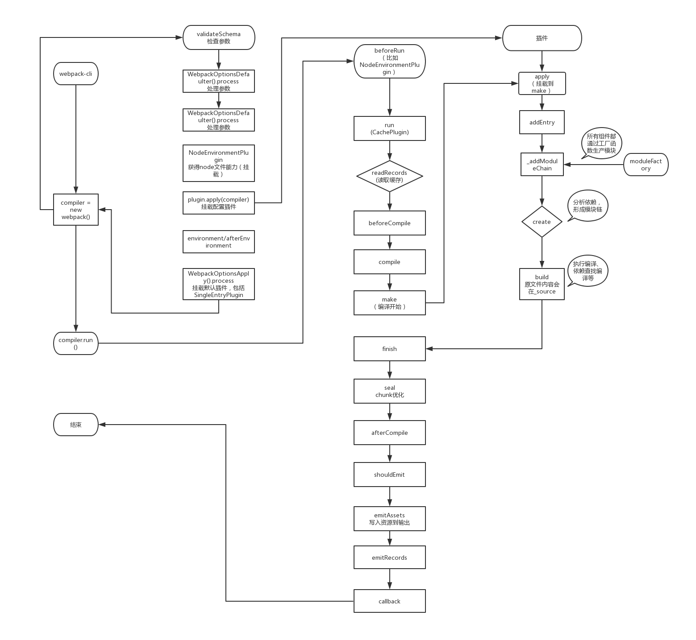

# webpack

分析`webpack`的源码，我们需要从`webpack-cli`分析起，毕竟我们是直接在`shell`中直接使用`webpack`的。为了更好的研究源码，首先创建个demo:

```
├── dist
├── index.html
├── node_modules
├── package.json
├── src
    ├── css
    │   └── index.css
    └── main.js
├── webpack.config.js
└── yarn.lock
```

```javaScript
// webpack.config.js
const path = require('path');
const HtmlWebpackPlugin = require("html-webpack-plugin");
module.exports = {
    entry: path.join(__dirname, "./src/main.js"),//模块入口
    output: {
        path: path.join(__dirname, './dist'),//输出的配置文件的目录
        filename: "bundle.js"//输出配置文件的js
    },
    plugins: [
        new HtmlWebpackPlugin({
            template: path.join(__dirname, "./index.html"),
            filename: "index.html"
        })
    ],
    mode: 'development',
    devtool: 'source-map',
    // watch: true,
    // watchOptions: {
    //   poll: 1000, // 每秒询问多少次
    //   aggregateTimeout: 500,  //防抖 多少毫秒后再次触发
    //   ignored: /node_modules/ //忽略时时监听
    // },
    module: {
        rules: [
            {
                test: /\.css$/, use: ["style-loader", "css-loader"]
            }
            // {
            //     test: /\.less$/, use: ["style-loader", "css-loader", "less-loader"]
            // }, {
            //     test: /\.scss$/, use: ["style-loader", "css-loader", "sass-loader"]
            // }
        ]
    }
}

```
## webpack-cli/webpack

安装`webpack-cli`时，会把`webpack`也装好。`webpack-cli`的入口文件是`webpack-cli/bin/cli.js`，这文件的主要作用是引入`webpack`生成`compiler`, 根据是否需要`watch`来运行。

```javaScript
// webpack-cli/bin/cli.js
// ...
const webpack = require("webpack");
let compiler;
try {
    compiler = webpack(options);
} catch (err) {
    throw err;
}
//
if (argv.progress) {
    const ProgressPlugin = require("webpack").ProgressPlugin;
    new ProgressPlugin({
        profile: argv.profile
    }).apply(compiler);
}
// 默认回调
function compilerCallback(err, stats) {
    // ...
}
// 如果是watch模式
if (firstOptions.watch || options.watch) {
    const watchOptions =
        firstOptions.watchOptions || options.watchOptions || firstOptions.watch || options.watch || {};
    if (watchOptions.stdin) {
        process.stdin.on("end", function(_) {
            process.exit(); // eslint-disable-line
        });
        process.stdin.resume();
    }
    // 执行的是compiler.watch
    compiler.watch(watchOptions, compilerCallback);
    if (outputOptions.infoVerbosity !== "none") console.error("\nwebpack is watching the files…\n");
} else {
    // 如果不是watch，直接run
    compiler.run((err, stats) => {
        if (compiler.close) {
            compiler.close(err2 => {
                compilerCallback(err || err2, stats);
            });
        } else {
            compilerCallback(err, stats);
        }
    });
}
```

首先，先把最终的流程图放一下：



在`webpack-cli`中，`require('wabpack')`是引用的`webpack`，它的入口文件时`webpack/lib/webpack.js`。在`webpack.js`中主要做了以下事情：

1. 验证`webpack`参数是否正确

```javaScript
const webpackOptionsValidationErrors = validateSchema(
    webpackOptionsSchema,
    options
);
if (webpackOptionsValidationErrors.length) {
    throw new WebpackOptionsValidationError(webpackOptionsValidationErrors);
}
```

`validateSchema`是通过预定义参数的`schema`， 来通过`ajv`这个第三方库来做判断的。

2. 判断`webpack`的参数是对象或者是数组，分别对应了是单页面应用还是多页面应用。如果是多页面，则会遍历分别执行`webpack(option)`。

```javaScript
compiler = new MultiCompiler(
    Array.from(options).map(options => webpack(options))
);
```

3. 结合默认参数，处理参数。

```javaScript
// WebpackOptionsDefaulter 初始化时会默认设置一些配置 这也是webpack4可以零配置的原因。
options = new WebpackOptionsDefaulter().process(options);
```

`WebpackOptionsDefaulter`是继承`OptionsDefaulter`， 在初始化创建实例时，通过`set`创建了很多默认配置。

```javaScript
// OptionsDefaulter
// 如果三个参数，则代表第三个参数为默认值，第二个值是config配置
// 如果两个参数，则默认值就就是第二个值。没有其他配置
// this.set("cache", "make", options => options.mode === "development");
// this.set("context", process.cwd());
set(name, config, def) {
    if (def !== undefined) {
        this.defaults[name] = def;
        this.config[name] = config;
    } else {
        this.defaults[name] = config;
        delete this.config[name];
    }
}
```

`process`是根据默认参数的类型来处理参数——`call`/`make`/`append`。

```javaScript
process(options) {
    options = Object.assign({}, options);
    for (let name in this.defaults) {
        switch (this.config[name]) {
            // 把默认的值赋值到option
            case undefined:
                if (getProperty(options, name) === undefined) {
                    setProperty(options, name, this.defaults[name]);
                }
                break;
            // 直接执行option.name 再复制给option.name
            case "call":
                setProperty(
                    options,
                    name,
                    this.defaults[name].call(this, getProperty(options, name), options)
                );
                break;
            // 执行默认的name赋值给option
            case "make":
                if (getProperty(options, name) === undefined) {
                    setProperty(options, name, this.defaults[name].call(this, options));
                }
                break;
            // 把默认值追加到options中
            case "append": {
                let oldValue = getProperty(options, name);
                if (!Array.isArray(oldValue)) {
                    oldValue = [];
                }
                oldValue.push(...this.defaults[name]);
                setProperty(options, name, oldValue);
                break;
            }
            default:
                throw new Error(
                    "OptionsDefaulter cannot process " + this.config[name]
                );
        }
    }
    return options;
}
```

4. 创建`compiler`实例。`context`为当前工作目录，`options`也会有`entry`入口文件。

```javaScript
compiler = new Compiler(options.context);
compiler.options = options;
```

5. 获得`node`环境的能力——读写与watcher的能力，同时这个在`beforeRun`挂载钩子。

```javaScript
new NodeEnvironmentPlugin({
    infrastructureLogging: options.infrastructureLogging
}).apply(compiler);

class NodeEnvironmentPlugin {
    constructor(options) {
        this.options = options || {};
    }

    apply(compiler) {
        // 日志输出-使用node console
        compiler.infrastructureLogger = createConsoleLogger(
            Object.assign(
                {
                    level: "info",
                    debug: false,
                    console: nodeConsole
                },
                this.options.infrastructureLogging
            )
        );
        // 文件文件夹下的文件
        compiler.inputFileSystem = new CachedInputFileSystem(
            new NodeJsInputFileSystem(),
            60000
        );
        const inputFileSystem = compiler.inputFileSystem;
        // 创建文件夹 文件 link等能力
        compiler.outputFileSystem = new NodeOutputFileSystem();
        compiler.watchFileSystem = new NodeWatchFileSystem(
            compiler.inputFileSystem
        );
        // 挂载beforeRun钩子，在执行时清除缓存
        compiler.hooks.beforeRun.tap("NodeEnvironmentPlugin", compiler => {
            if (compiler.inputFileSystem === inputFileSystem) inputFileSystem.purge();
        });
    }
}
```

6. 挂载参数中的插件

```javaScript
// 此处的插件只有 HtmlWebpackPlugin
if (options.plugins && Array.isArray(options.plugins)) {
    for (const plugin of options.plugins) {
        if (typeof plugin === "function") {
            plugin.call(compiler, compiler);
        } else {
            // 应用插件HtmlWebpackPlugin
            // 在make、emit阶段挂载HtmlWebpackPlugin
            plugin.apply(compiler);
        }
    }
}
```

7. 执行`environment`与`afterEnvironment`的钩子, 就本例子来说，暂时没有具体钩子触发。`new WebpackOptionsApply().process`应用了很多插件。

```javaScript
compiler.hooks.environment.call();
compiler.hooks.afterEnvironment.call();
compiler.options = new WebpackOptionsApply().process(options, compiler);
```

`target`为`web`时，应用的插件有很多，大都是能力插件。还有挂载`SingleEntryPlugin`钩子到make上。

```javaScript
new JsonpTemplatePlugin().apply(compiler);
new FetchCompileWasmTemplatePlugin({
    mangleImports: options.optimization.mangleWasmImports
}).apply(compiler);
new FunctionModulePlugin().apply(compiler);
new NodeSourcePlugin(options.node).apply(compiler);
new LoaderTargetPlugin(options.target).apply(compiler);

// ... devtool的处理插件

new JavascriptModulesPlugin().apply(compiler);
new JsonModulesPlugin().apply(compiler);
new WebAssemblyModulesPlugin({
    mangleImports: options.optimization.mangleWasmImports
}).apply(compiler);

new EntryOptionPlugin().apply(compiler);
new JavascriptModulesPlugin().apply(compiler);
new JsonModulesPlugin().apply(compiler);
new WebAssemblyModulesPlugin({
    mangleImports: options.optimization.mangleWasmImports
}).apply(compiler);

new EntryOptionPlugin().apply(compiler);
new CompatibilityPlugin().apply(compiler);
new HarmonyModulesPlugin(options.module).apply(compiler);
new AMDPlugin(options.module, options.amd || {}).apply(compiler);
new RequireJsStuffPlugin().apply(compiler);
new CommonJsPlugin(options.module).apply(compiler);
new LoaderPlugin().apply(compiler);
new NodeStuffPlugin(options.node).apply(compiler);
new CommonJsStuffPlugin().apply(compiler);
new APIPlugin().apply(compiler);
new ConstPlugin().apply(compiler);
new UseStrictPlugin().apply(compiler);
new RequireIncludePlugin().apply(compiler);
new RequireEnsurePlugin().apply(compiler);
new RequireContextPlugin(
    options.resolve.modules,
    options.resolve.extensions,
    options.resolve.mainFiles
).apply(compiler);
new ImportPlugin(options.module).apply(compiler);
new SystemPlugin(options.module).apply(compiler);
// ...
```

8. 如果`callback`，则直接执行`compiler.run`，否则只暴露`compiler`。

```javaScript
if (callback) {
    if (
        options.watch === true ||
        (Array.isArray(options) && options.some(o => o.watch))
    ) {
        const watchOptions = Array.isArray(options)
            ? options.map(o => o.watchOptions || {})
            : options.watchOptions || {};
        return compiler.watch(watchOptions, callback);
    }
    compiler.run(callback);
}
```

9. 把默认参数、node环境能力等挂载到`webpack`上。

```javaScript
webpack.WebpackOptionsDefaulter = WebpackOptionsDefaulter;
webpack.WebpackOptionsApply = WebpackOptionsApply;
webpack.Compiler = Compiler;
webpack.MultiCompiler = MultiCompiler;
webpack.NodeEnvironmentPlugin = NodeEnvironmentPlugin;
// @ts-ignore Global @this directive is not supported
webpack.validate = validateSchema.bind(this, webpackOptionsSchema);
webpack.validateSchema = validateSchema;
webpack.WebpackOptionsValidationError = WebpackOptionsValidationError;
```

## Compiler

`Compiler`是继承`tapable`，在`hooks`对象中定义各种了钩子管理器——`shouldEmit/beforeRun`...，用于在对应的时机调用。

```javaScript
class Compiler extends Tapable {
    constructor(context) {
        super();
        this.hooks = {
            // 钩子管理
        }
    }
}
```

当执行`compiler.run()`时，首先通过`this.hooks.beforeRun.callAsync`，来执行`beforeRun`的钩子，再执行`run`的钩子。然后执行`readRecords`, 它的回调为`compile`

```javaScript
run(callback) {
    const finalCallback = (err, stats) => {
        // 回调
    };
    // 编译完成的回调
    const onCompiled = (err, compilation) => {}
    this.hooks.beforeRun.callAsync(this, err => {
        if (err) return finalCallback(err);
        this.hooks.run.callAsync(this, err => {
            if (err) return finalCallback(err);
            this.readRecords(err => {
                if (err) return finalCallback(err);
                this.compile(onCompiled);
            });
        });
    });
}
```

`beforeRun`执行的主要钩子函数为`NodeEnvironmentPlugin`, 获取node能力。`run`主要是执行的`CachePlugin`，会把编译过程的缓存与`compilation`进行关联。

编译过的话，`readRecords`是读取编译记录。

```javaScript
// readRecords
readRecords(callback) {
    if (!this.recordsInputPath) {
        this.records = {};
        return callback();
    }
    this.inputFileSystem.stat(this.recordsInputPath, err => {
        // It doesn't exist
        // We can ignore this.
        if (err) return callback();
        this.inputFileSystem.readFile(this.recordsInputPath, (err, content) => {
            if (err) return callback(err);
            try {
                this.records = parseJson(content.toString("utf-8"));
            } catch (e) {
                e.message = "Cannot parse records: " + e.message;
                return callback(e);
            }
            return callback();
        });
    });
}
```

在理解后面源码时，得先理解下`NormalModuleFactory`。它是一个构件模块的类，它通过`create`方法来创造模块，对依赖进行分析，递归加载模块。`loaders`会存放在`ruleSet`。

```javaScript
class NormalModuleFactory extends Tapable {
    constructor(context, resolverFactory, options) {
        super();
        this.hooks = {
            resolver: new SyncWaterfallHook(["resolver"]),
            factory: new SyncWaterfallHook(["factory"]),
            beforeResolve: new AsyncSeriesWaterfallHook(["data"]),
            afterResolve: new AsyncSeriesWaterfallHook(["data"]),
            createModule: new SyncBailHook(["data"]),
            module: new SyncWaterfallHook(["module", "data"]),
            createParser: new HookMap(() => new SyncBailHook(["parserOptions"])),
            parser: new HookMap(() => new SyncHook(["parser", "parserOptions"])),
            createGenerator: new HookMap(
                () => new SyncBailHook(["generatorOptions"])
            ),
            generator: new HookMap(
                () => new SyncHook(["generator", "generatorOptions"])
            )
        };
        this.ruleSet = new RuleSet(options.defaultRules.concat(options.rules));
    }

    create(data, callback) {
        // 依赖模块
        const dependencies = data.dependencies;
        const cacheEntry = dependencyCache.get(dependencies[0]);
        if (cacheEntry) return callback(null, cacheEntry);
        const context = data.context || this.context;
        const resolveOptions = data.resolveOptions || EMPTY_RESOLVE_OPTIONS;
        // request 表示依赖加载地址 非js文件会补充解析模块地址。比如入口文件为
        //"/Users/sampan/doc/work/github/cli/node_modules/html-webpack-plugin/lib/loader.js!/Users/sampan/doc/work/github/cli/index.html"
        // 而入口文件直接为"/Users/sampan/doc/work/github/cli/src/main.js"
        const request = dependencies[0].request;
        const contextInfo = data.contextInfo || {};
        this.hooks.beforeResolve.callAsync(
            {
                contextInfo,
                resolveOptions,
                context,
                request,
                dependencies
            },
            // result 表示模块对象 模块路径 使用解析模块
            (err, result) => {
                const factory = this.hooks.factory.call(null);
                factory(result, (err, module) => {
                    if (module && this.cachePredicate(module)) {
                        for (const d of dependencies) {
                            dependencyCache.set(d, module);
                        }
                    }
                    callback(null, module);
                });
            }
        );
    }

    resolveRequestArray(contextInfo, context, array, resolver, callback) {
    }

    getParser(type, parserOptions) {
    }

    createParser(type, parserOptions = {}) {
    }

    doBuild(options, compilation, resolver, fs, callback) {
        const loaderContext = this.createLoaderContext(
            resolver,
            options,
            compilation,
            fs
        );
        // 应用loader
        runLoaders(
            {
                resource: this.resource,
                loaders: this.loaders,
                context: loaderContext,
                readResource: fs.readFile.bind(fs)
            },
            (err, result) => {
                if (result) {
                    this.buildInfo.cacheable = result.cacheable;
                    this.buildInfo.fileDependencies = new Set(result.fileDependencies);
                    this.buildInfo.contextDependencies = new Set(
                        result.contextDependencies
                    );
                }

                const resourceBuffer = result.resourceBuffer;
                const source = result.result[0];
                const sourceMap = result.result.length >= 1 ? result.result[1] : null;
                const extraInfo = result.result.length >= 2 ? result.result[2] : null;

                if (!Buffer.isBuffer(source) && typeof source !== "string") {
                    const currentLoader = this.getCurrentLoader(loaderContext, 0);
                    const err = new Error(
                        `Final loader (${
                            currentLoader
                                ? compilation.runtimeTemplate.requestShortener.shorten(
                                        currentLoader.loader
                                    )
                                : "unknown"
                        }) didn't return a Buffer or String`
                    );
                    const error = new ModuleBuildError(this, err);
                    return callback(error);
                }
                // 内容赋值到_source
                this._source = this.createSource(
                    this.binary ? asBuffer(source) : asString(source),
                    resourceBuffer,
                    sourceMap
                );
                this._sourceSize = null;
                // 挂载_ast
                this._ast =
                    typeof extraInfo === "object" &&
                    extraInfo !== null &&
                    extraInfo.webpackAST !== undefined
                        ? extraInfo.webpackAST
                        : null;
                return callback();
            }
        );
    }

    build(options, compilation, resolver, fs, callback) {

        return this.doBuild(options, compilation, resolver, fs, err => {
            this._cachedSources.clear();
            try {
                // 通过parse 解析 源码到 module._source
                const result = this.parser.parse(
                    this._ast || this._source.source(),
                    {
                        current: this,
                        module: this,
                        compilation: compilation,
                        options: options
                    },
                    (err, result) => {
                        if (err) {
                            handleParseError(err);
                        } else {
                            handleParseResult(result);
                        }
                    }
                );
                if (result !== undefined) {
                    // parse is sync
                    handleParseResult(result);
                }
            } catch (e) {
                handleParseError(e);
            }
        });
    }
}
```

`run`方法会执行`compile`。在`compile()`时，会先后执行`beforeCompile`/`compile.call`/`make.callAsync`/`compilation.finish`/`compilation.seal`/`afterCompile.callAsync/shouldEmit/this.emitAssets`。这与之前`beforeRun`时触发的函数构成了整个`webpack`执行流程。

```javaScript
// compile
compile(callback) {
    const params = this.newCompilationParams();
    this.hooks.beforeCompile.callAsync(params, err => {
        if (err) return callback(err);
        this.hooks.compile.call(params);
        const compilation = this.newCompilation(params);
        this.hooks.make.callAsync(compilation, err => {
            if (err) return callback(err);
            compilation.finish(err => {
                if (err) return callback(err);
                compilation.seal(err => {
                    if (err) return callback(err);
                    this.hooks.afterCompile.callAsync(compilation, err => {
                        if (err) return callback(err);
                        return callback(null, compilation);
                    });
                });
            });
        });
    });
}
```

看到这里，就会发现`webpack`就是基于`tapable`的发布订阅实现的一个插件管理系统，通过在整个流程不同阶段挂载触发对应的钩子来实现模块的打包、处理、输出。


#### beforeRun

`beforeRun`挂载的钩子是在获取`node`环境能力时的`NodeEnvironmentPlugin`，这个地方会执行`inputFileSystem.purge()`, 主要是本地缓存数据初始化。

```javaScript
compiler.hooks.beforeRun.tap("NodeEnvironmentPlugin", compiler => {
    if (compiler.inputFileSystem === inputFileSystem) inputFileSystem.purge();
});
```

```javaScript
// purge
purge(what) {
    // 本地缓存初始化
    this._statStorage.purge(what);
    // 读取文件夹缓存初始化
    this._readdirStorage.purge(what);
    // 读取文件
    this._readFileStorage.purge(what);
    this._readlinkStorage.purge(what);
    this._readJsonStorage.purge(what);
}
// inputFileSystem.purge
purge(what) {
    if (!what) {
        this.count = 0;
        clearInterval(this.interval);
        this.nextTick = null;
        this.data.clear();
        this.levels.forEach(level => {
            level.clear();
        });
    } else if (typeof what === "string") {
        for (let key of this.data.keys()) {
            if (key.startsWith(what)) this.data.delete(key);
        }
    } else {
        for (let i = what.length - 1; i >= 0; i--) {
            this.purge(what[i]);
        }
    }
}
```
#### run.callAsync

`run`挂载的钩子是`CachePlugin`。

```javaScript
compiler.hooks.run.tapAsync("CachePlugin", (compiler, callback) => {
    // 就demo来说，_lastCompilationFileDependencies为undefined
    if (!compiler._lastCompilationFileDependencies) {
        return callback();
    }
});
```

#### readRecords

就`demo`来说，`readRecords`是直接执行了回调`compile`

#### compile函数

`compile`函数中，首先通过`newCompilationParams()`返回`params`:

```javaScript
const params = {
    normalModuleFactory: this.createNormalModuleFactory(),
    contextModuleFactory: this.createContextModuleFactory(),
    compilationDependencies: new Set()
};
```

`normalModuleFactory`与`contextModuleFactory`都是基于`tapable`的`module`工厂。大部分用到的模块都是`normalModuleFactory`。

#### newCompilation

根据`this.newCompilation`生成`compilation`。

```javaScript
newCompilation(params) {
    const compilation = this.createCompilation();
    compilation.fileTimestamps = this.fileTimestamps;
    compilation.contextTimestamps = this.contextTimestamps;
    compilation.name = this.name;
    compilation.records = this.records;
    compilation.compilationDependencies = params.compilationDependencies;
    this.hooks.thisCompilation.call(compilation, params);
    this.hooks.compilation.call(compilation, params);
    return compilation;
}
```

`newcompilation`也是继承`tapable`。`compile`可以理解为编译器，控制着整个流程。而`compilation`则是一个编译对象，拥有整个过程产生的一切对象`build->seal`。

```javaScript
class Compilation extends Tapable {
    constructor(compiler) {
        // 钩子管理器
        this.hooks = {
        };
        // webpack 实例
        this.compiler = compiler;
        // 编译性能
        this.semaphore = new Semaphore(options.parallelism || 100);
    }

    /**
        * @typedef {Object} AddModuleResult
        * @property {Module} module the added or existing module
        * @property {boolean} issuer was this the first request for this module
        * @property {boolean} build should the module be build
        * @property {boolean} dependencies should dependencies be walked
        */
    addModule(module, cacheGroup) {
        return {
            module: module,
            issuer: true,
            build: true,
            dependencies: true
        };
    }
    buildModule(module, optional, origin, dependencies, thisCallback) {
    }
    _addModuleChain(context, dependency, onModule, callback) {
    }
    addEntry(context, entry, name, callback) {
    }
    seal(callback) {
    }
    addChunk(name) {
    }
    emitAsset(file, source, assetInfo = {}) {
    }
}
```


#### make.callAsync

`make`则是开始进行编译，会先后触发`HtmlWebpackPlugin`与`SingleEntryPlugin`钩子。

`SingleEntryPlugin`钩子会触发`compilation.addEntry`，`addEntry`主要是调用了`this._addModuleChain`。它的入参：

`context`是入口文件等信息

`Dependency`是指依赖模块——SingleEntryDependency的实例。

`onModule`是模块放入entry中

```javaScript
// 添加模块 执行build
_addModuleChain(context, dependency, onModule, callback) {
    // Dep 是获得依赖模块的class -》class SingleEntryDependency extends ModuleDependency { … }
    const Dep = /** @type {DepConstructor} */ (dependency.constructor);
    // 是依赖的moduleFactory
    const moduleFactory = this.dependencyFactories.get(Dep);
    // Semaphore是一个信标，用来控制webpack make 占用资源的数量， 默认100个。
    this.semaphore.acquire(() => {
        moduleFactory.create(
            {
                contextInfo: {
                    issuer: "",
                    compiler: this.compiler.name
                },
                context: context,
                dependencies: [dependency]
            },
            // module 是 normalModuleFactory create 以后得一个模块。是一个包含模块解析路径等信息。
            (err, module) => {
                if (err) {
                    this.semaphore.release();
                    return errorAndCallback(new EntryModuleNotFoundError(err));
                }
                // 添加模块到缓存
                const addModuleResult = this.addModule(module);
                module = addModuleResult.module;
                // 把模块添加到compilation.entery中
                onModule(module);
                dependency.module = module;
                module.addReason(null, dependency);
                const afterBuild = () => {
                    if (addModuleResult.dependencies) {
                        this.processModuleDependencies(module, err => {
                            if (err) return callback(err);
                            callback(null, module);
                        });
                    } else {
                        return callback(null, module);
                    }
                };
                if (addModuleResult.issuer) {
                    if (currentProfile) {
                        module.profile = currentProfile;
                    }
                }
                // 执行build 此时源码已经读取出
                if (addModuleResult.build) {
                    this.buildModule(module, false, null, null, err => {
                        if (err) {
                            this.semaphore.release();
                            return errorAndCallback(err);
                        }

                        if (currentProfile) {
                            const afterBuilding = Date.now();
                            currentProfile.building = afterBuilding - afterFactory;
                        }

                        this.semaphore.release();
                        afterBuild();
                    });
                } else {
                    this.semaphore.release();
                    this.waitForBuildingFinished(module, afterBuild);
                }
            }
        );
    });
}
```

#### seal

`seal`中，主要是对进行优化等操作。

```javaScript
seal(callback) {
    this.hooks.seal.call();

    while (
        this.hooks.optimizeDependenciesBasic.call(this.modules) ||
        this.hooks.optimizeDependencies.call(this.modules) ||
        this.hooks.optimizeDependenciesAdvanced.call(this.modules)
    ) {
        /* empty */
    }
    this.hooks.afterOptimizeDependencies.call(this.modules);

    this.hooks.beforeChunks.call();
    for (const preparedEntrypoint of this._preparedEntrypoints) {
        const module = preparedEntrypoint.module;
        const name = preparedEntrypoint.name;
        const chunk = this.addChunk(name);
        const entrypoint = new Entrypoint(name);
        entrypoint.setRuntimeChunk(chunk);
        entrypoint.addOrigin(null, name, preparedEntrypoint.request);
        this.namedChunkGroups.set(name, entrypoint);
        this.entrypoints.set(name, entrypoint);
        this.chunkGroups.push(entrypoint);

        GraphHelpers.connectChunkGroupAndChunk(entrypoint, chunk);
        GraphHelpers.connectChunkAndModule(chunk, module);

        chunk.entryModule = module;
        chunk.name = name;

        this.assignDepth(module);
    }
    buildChunkGraph(
        this,
        /** @type {Entrypoint[]} */ (this.chunkGroups.slice())
    );
    this.sortModules(this.modules);
    this.hooks.afterChunks.call(this.chunks);

    this.hooks.optimize.call();

    while (
        this.hooks.optimizeModulesBasic.call(this.modules) ||
        this.hooks.optimizeModules.call(this.modules) ||
        this.hooks.optimizeModulesAdvanced.call(this.modules)
    ) {
        /* empty */
    }
    this.hooks.afterOptimizeModules.call(this.modules);

    while (
        this.hooks.optimizeChunksBasic.call(this.chunks, this.chunkGroups) ||
        this.hooks.optimizeChunks.call(this.chunks, this.chunkGroups) ||
        this.hooks.optimizeChunksAdvanced.call(this.chunks, this.chunkGroups)
    ) {
        /* empty */
    }
    this.hooks.afterOptimizeChunks.call(this.chunks, this.chunkGroups);

    this.hooks.optimizeTree.callAsync(this.chunks, this.modules, err => {
        if (err) {
            return callback(err);
        }

        this.hooks.afterOptimizeTree.call(this.chunks, this.modules);

        while (
            this.hooks.optimizeChunkModulesBasic.call(this.chunks, this.modules) ||
            this.hooks.optimizeChunkModules.call(this.chunks, this.modules) ||
            this.hooks.optimizeChunkModulesAdvanced.call(this.chunks, this.modules)
        ) {
            /* empty */
        }
        this.hooks.afterOptimizeChunkModules.call(this.chunks, this.modules);

        const shouldRecord = this.hooks.shouldRecord.call() !== false;

        this.hooks.reviveModules.call(this.modules, this.records);
        this.hooks.optimizeModuleOrder.call(this.modules);
        this.hooks.advancedOptimizeModuleOrder.call(this.modules);
        this.hooks.beforeModuleIds.call(this.modules);
        this.hooks.moduleIds.call(this.modules);
        this.applyModuleIds();
        this.hooks.optimizeModuleIds.call(this.modules);
        this.hooks.afterOptimizeModuleIds.call(this.modules);

        this.sortItemsWithModuleIds();

        this.hooks.reviveChunks.call(this.chunks, this.records);
        this.hooks.optimizeChunkOrder.call(this.chunks);
        this.hooks.beforeChunkIds.call(this.chunks);
        this.applyChunkIds();
        this.hooks.optimizeChunkIds.call(this.chunks);
        this.hooks.afterOptimizeChunkIds.call(this.chunks);

        this.sortItemsWithChunkIds();

        if (shouldRecord) {
            this.hooks.recordModules.call(this.modules, this.records);
            this.hooks.recordChunks.call(this.chunks, this.records);
        }

        this.hooks.beforeHash.call();
        this.createHash();
        this.hooks.afterHash.call();

        if (shouldRecord) {
            this.hooks.recordHash.call(this.records);
        }

        this.hooks.beforeModuleAssets.call();
        // 创建资源输出
        this.createModuleAssets();
        if (this.hooks.shouldGenerateChunkAssets.call() !== false) {
            this.hooks.beforeChunkAssets.call();
            this.createChunkAssets();
        }
        this.hooks.additionalChunkAssets.call(this.chunks);
        this.summarizeDependencies();
        if (shouldRecord) {
            this.hooks.record.call(this, this.records);
        }

        this.hooks.additionalAssets.callAsync(err => {
            if (err) {
                return callback(err);
            }
            this.hooks.optimizeChunkAssets.callAsync(this.chunks, err => {
                if (err) {
                    return callback(err);
                }
                this.hooks.afterOptimizeChunkAssets.call(this.chunks);
                this.hooks.optimizeAssets.callAsync(this.assets, err => {
                    if (err) {
                        return callback(err);
                    }
                    this.hooks.afterOptimizeAssets.call(this.assets);
                    if (this.hooks.needAdditionalSeal.call()) {
                        this.unseal();
                        return this.seal(callback);
                    }
                    return this.hooks.afterSeal.callAsync(callback);
                });
            });
        });
    });
}
```

`afterSeal`执行`cachePlugin`。

最后执行`oncompiled`, 主要是打包资源到输出目录。

```javaScript
if (this.hooks.shouldEmit.call(compilation) === false) {
    const stats = new Stats(compilation);
    stats.startTime = startTime;
    stats.endTime = Date.now();
    this.hooks.done.callAsync(stats, err => {
        if (err) return finalCallback(err);
        return finalCallback(null, stats);
    });
    return;
}
// 输出所有资源到dist
this.emitAssets(compilation, err => {
    if (err) return finalCallback(err);

    if (compilation.hooks.needAdditionalPass.call()) {
        compilation.needAdditionalPass = true;

        const stats = new Stats(compilation);
        stats.startTime = startTime;
        stats.endTime = Date.now();
        this.hooks.done.callAsync(stats, err => {
            if (err) return finalCallback(err);

            this.hooks.additionalPass.callAsync(err => {
                if (err) return finalCallback(err);
                this.compile(onCompiled);
            });
        });
        return;
    }
    // 写入记录
    this.emitRecords(err => {
        if (err) return finalCallback(err);

        const stats = new Stats(compilation);
        stats.startTime = startTime;
        stats.endTime = Date.now();
        this.hooks.done.callAsync(stats, err => {
            if (err) return finalCallback(err);
            return finalCallback(null, stats);
        });
    });
});
```

## sourcemap

`webpack`的`source-map`是通过`devtool`来设置的。分别对应以下几个值：

1, `none` 不产生`sourcemap`。一般用于生产环境，构建速度最快。

2，`eval` 每个模块会封装到`eval`，在末位追加注释。

```javaScript
function(module,exports,__webpack_require__){
eval(
      ...
//# sourceURL=webpack:///./src/static/css/app.less?./~/.npminstall/css-loader/0.23.1/css-loader!./~/.npminstall/postcss-loader/1.1.1/postcss-loader!./~/.npminstall/less-loader/2.2.3/less-loader'
    )
  },
```

3，`source-map` 生成一个`sourcemap`文件，在末位也有注释。

```javaScript
webpackJsonp([1],[
function(e,t,i){...},
function(e,t,i){...},
function(e,t,i){...},
function(e,t,i){...},
  ...
])//# sourceMappingURL=index.js.map
```

4，`hidden-source-map`与`source-map`一样，只不过句末没有注释。

5，`inline-source-map`是`sourcemap`的内容以`DataURL`的形势放在末尾。这种情况下`bundle`比较大。

6，`cheap-source-map`与`source-map`一样，但是生成的`source-map`代码比较少，少了列信息。

7, `cheap-module-source-map`比`cheap-source-map`又少了`sourcesContent`

最后：

1, `cheap`可以提供`sourcemap`生成效率

2，`eval`可大幅度提供持续构建效率。

3，`module`可支持`babel`预编译工具。

4，生产环境建议使用`cheap-module-source-map`，开发环境`cheap-module-eval-source-map`。

## webpack性能优化

1，根据打包流程，虽然可以做`treeshaking`，但是总要依赖分析，所以最好手动直接在项目代码中删除未用到模块，减少打包时间。

2，增量构建，缓存第一次打包结果。

3，使用HappyPack, 多进程打包

4，resolve缩小文件搜索范围

5，ParallelUglifyPlugin多进程压缩

## 插件

`webpack`是基于`tapable`的插件管理系统，所以开发`webpack`的插件只需要把处理方法，挂载到对应的生命周期上。比如`make`、`run`等。

```
function ExamplePlugin() {
}
ExamplePlugin.prototype.apply = function(compiler){
    compiler.plugin('make', (compilation) => {
        // todo
    })
}
```

## webpack打包模块webpack_require

`webpack`打包生成的`bundle`文件是一个自执行函数，函数内部实现一个`webpack_require`模块解析方法。以下是一个经典打包后的代码：

```javaScript
(function(modules) {
// 模块缓存作用，已加载的模块可以不用再重新读取
var installedModules = {};

// 关键函数，加载模块代码
// 形式有点像Node的CommonJS模块，但这里是可跑在浏览器上的es5代码
function __webpack_require__(moduleId) {
  // 缓存检查，有则直接从缓存中取得
  if(installedModules[moduleId]) {
    return installedModules[moduleId].exports;
  }
  // 先创建一个空模块，塞入缓存中
  var module = installedModules[moduleId] = {
    i: moduleId,
    l: false, // 标记是否已经加载
    exports: {} // 初始模块为空
  };

  // 把要加载的模块内容，挂载到module.exports上
  modules[moduleId].call(module.exports, module, module.exports, __webpack_require__);
  module.l = true; // 标记为已加载

  // 返回加载的模块，调用方直接调用即可
  return module.exports;
}

 // Webpack 配置中的 publicPath，用于加载被分割出去的异步代码
__webpack_require__.p = "";

// __webpack_require__对象下的r函数
// 在module.exports上定义__esModule为true，表明是一个es模块。默认返回modele.default，否则为module
__webpack_require__.r = function(exports) {
  Object.defineProperty(exports, '__esModule', { value: true });
};

// 启动入口模块main.js
// 当参数为一个数组时，则入口通常为索引为0的模块
return __webpack_require__(__webpack_require__.s = "./src/main.js");
})
({
  // add模块
  "./src/add.js": (function(module, __webpack_exports__, __webpack_require__) {
    // 在module.exports上定义__esModule为true
    __webpack_require__.r(__webpack_exports__);
    // 直接把add模块内容，赋给module.exports.default对象上
    __webpack_exports__["default"] = (function(a, b) {
      let { name } = { name: 'hello world,'}
      return name + a + b
    });
  }),

  // 入口模块
  "./src/main.js": (function(module, __webpack_exports__, __webpack_require__) {
    __webpack_require__.r(__webpack_exports__)
    // 拿到add模块的定义
    // _add__WEBPACK_IMPORTED_MODULE_0__ = module.exports，有点类似require
    var _add__WEBPACK_IMPORTED_MODULE_0__ = __webpack_require__("./src/add.js");
    // add模块内容: _add__WEBPACK_IMPORTED_MODULE_0__["default"]
    console.log(_add__WEBPACK_IMPORTED_MODULE_0__["default"], Object(_add__WEBPACK_IMPORTED_MODULE_0__["default"])(1, 2))
  })
});
```

如果通过异步加载的模块，是使用`webpackJsonp`的方法来加载的：

```javaScript
(function (modules) {
  /***
   * webpackJsonp 用于从异步加载的文件中安装模块。
   * 把 webpackJsonp 挂载到全局是为了方便在其它文件中调用。
   *
   * @param chunkIds 异步加载的文件中存放的需要安装的模块对应的 Chunk ID
   * @param moreModules 异步加载的文件中存放的需要安装的模块列表
   * @param executeModules 在异步加载的文件中存放的需要安装的模块都安装成功后，需要执行的模块对应的 index
   */
  window["webpackJsonp"] = function webpackJsonpCallback(chunkIds, moreModules, executeModules) {
    // 把 moreModules 添加到 modules 对象中
    // 把所有 chunkIds 对应的模块都标记成已经加载成功
    var moduleId, chunkId, i = 0, resolves = [], result;
    for (; i < chunkIds.length; i++) {
      chunkId = chunkIds[i];
      if (installedChunks[chunkId]) {
        resolves.push(installedChunks[chunkId][0]);
      }
      installedChunks[chunkId] = 0;
    }
    for (moduleId in moreModules) {
      if (Object.prototype.hasOwnProperty.call(moreModules, moduleId)) {
        modules[moduleId] = moreModules[moduleId];
      }
    }
    while (resolves.length) {
      resolves.shift()();
    }
  };

  // 缓存已经安装的模块
  var installedModules = {};

  // 存储每个 Chunk 的加载状态；
  // 键为 Chunk 的 ID，值为0代表已经加载成功
  var installedChunks = {
    1: 0
  };

  // 模拟 require 语句，和上面介绍的一致
  function __webpack_require__(moduleId) {
    // ... 省略和上面一样的内容
  }

  /**
   * 用于加载被分割出去的，需要异步加载的 Chunk 对应的文件
   * @param chunkId 需要异步加载的 Chunk 对应的 ID
   * @returns {Promise}
   */
  __webpack_require__.e = function requireEnsure(chunkId) {
    // 从上面定义的 installedChunks 中获取 chunkId 对应的 Chunk 的加载状态
    var installedChunkData = installedChunks[chunkId];
    // 如果加载状态为0表示该 Chunk 已经加载成功了，直接返回 resolve Promise
    if (installedChunkData === 0) {
      return new Promise(function (resolve) {
        resolve();
      });
    }

    // installedChunkData 不为空且不为0表示该 Chunk 正在网络加载中
    if (installedChunkData) {
      // 返回存放在 installedChunkData 数组中的 Promise 对象
      return installedChunkData[2];
    }

    // installedChunkData 为空，表示该 Chunk 还没有加载过，去加载该 Chunk 对应的文件
    var promise = new Promise(function (resolve, reject) {
      installedChunkData = installedChunks[chunkId] = [resolve, reject];
    });
    installedChunkData[2] = promise;

    // 通过 DOM 操作，往 HTML head 中插入一个 script 标签去异步加载 Chunk 对应的 JavaScript 文件
    var head = document.getElementsByTagName('head')[0];
    var script = document.createElement('script');
    script.type = 'text/javascript';
    script.charset = 'utf-8';
    script.async = true;
    script.timeout = 120000;

    // 文件的路径为配置的 publicPath、chunkId 拼接而成
    script.src = __webpack_require__.p + "" + chunkId + ".bundle.js";

    // 设置异步加载的最长超时时间
    var timeout = setTimeout(onScriptComplete, 120000);
    script.onerror = script.onload = onScriptComplete;

    // 在 script 加载和执行完成时回调
    function onScriptComplete() {
      // 防止内存泄露
      script.onerror = script.onload = null;
      clearTimeout(timeout);

      // 去检查 chunkId 对应的 Chunk 是否安装成功，安装成功时才会存在于 installedChunks 中
      var chunk = installedChunks[chunkId];
      if (chunk !== 0) {
        if (chunk) {
          chunk[1](new Error('Loading chunk ' + chunkId + ' failed.'));
        }
        installedChunks[chunkId] = undefined;
      }
    };
    head.appendChild(script);

    return promise;
  };

  // 加载并执行入口模块，和上面介绍的一致
  return __webpack_require__(__webpack_require__.s = 0);
})
(
  // 存放所有没有经过异步加载的，随着执行入口文件加载的模块
  [
    // main.js 对应的模块
    (function (module, exports, __webpack_require__) {
      // 通过 __webpack_require__.e 去异步加载 show.js 对应的 Chunk
      __webpack_require__.e(0).then(__webpack_require__.bind(null, 1)).then((show) => {
        // 执行 show 函数
        show('Webpack');
      });
    })
  ]
);
```
