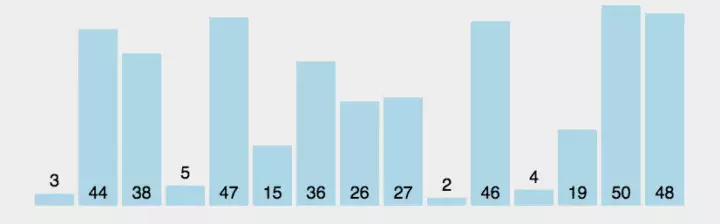

# 冒泡排序

> 比较相邻的元素，较大值放右边。时间复杂度为O(n^2).

```javaScript
function bubbleSort(arr) {
    let len = arr.length
    for (let i = 0 ; i < len; i++) {
        // 每次循环后，该数组的最后i+1个值都为排序好的最大，所以内循环循环的长度可以减去i+1
        for (let j = 0; j < len - 1 - i; j++ ) {
            if (arr[j+1] < arr[j]) {
                let tmp = arr[j+1]
                arr[j+1] = arr[j]
                arr[j] = tmp
            }
        }
    }
    return arr
}
```


