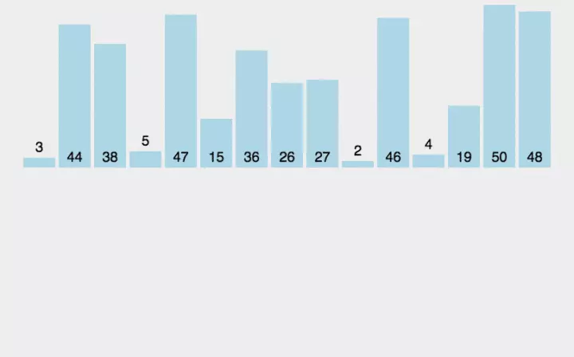

# 插入排序

> 队列中第一个认为是一个有序部分，从未排序部分拿出一个值，在有序中进行比较，如果大于拿出值，则有序中值往后移动一位。时间复杂度为O(n^2)

```javaSript
function InsertSort(arr) {
    let len = arr.length
    for (let i = 1 ; i < len; i++) {
        let j = i
        let jval = arr[j]
        while (j >= 0 && arr[j - 1] > jval) {
            arr[j] = arr[j-1]
            arr[j-1] = jval
            j--
        }
    }
    return arr
}
```


