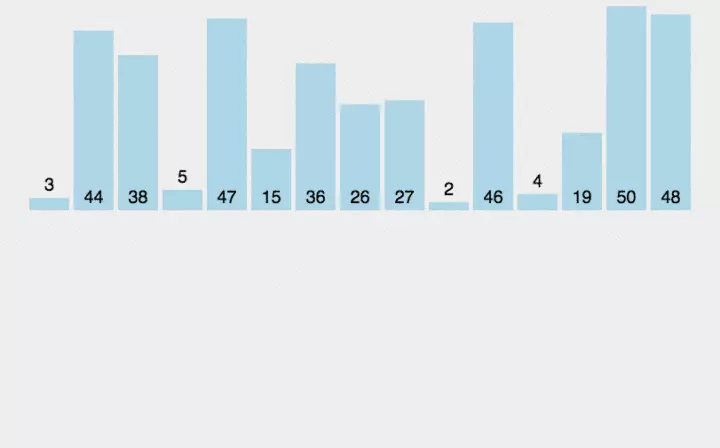

# 归并排序

> 对子序列表进行排序合并。时间复杂度为O(nlogn)。不过需要额外的内存空间。

```javaScript
function MergeSort(arr) {
    if (arr.length < 2) {
        return arr
    }
    let mid = Math.floor(arr.length / 2)
    let left = arr.slice(0, mid)
    let right = arr.slice(mid)
    return merge(MergeSort(left), MergeSort(right))
}

function merge(leftArr, rightArr) {
    let arr = []
    let leftLen = leftArr.length
    let rightLen = rightArr.length

    while (leftLen || rightLen) {
        if (!rightLen) {
            arr.unshift(leftArr[leftLen - 1])
            leftLen--
        }else if (!leftLen) {
            arr.unshift(rightArr[rightLen - 1])
            rightLen--
        } else if(leftArr[leftLen - 1] > rightArr[rightLen - 1]) {
            arr.unshift(leftArr[leftLen - 1])
            leftLen--
        } else if (leftArr[leftLen - 1] < rightArr[rightLen - 1]) {
            arr.unshift(rightArr[rightLen - 1])
            rightLen--
        }
    }
    return arr
}
```


