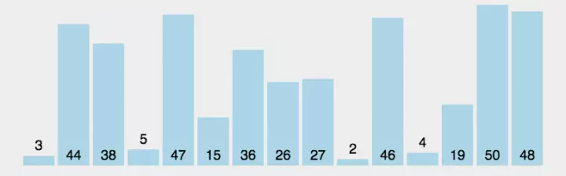

# 快速排序

> 挑出一个基准值，小于基于值得放基准值左侧，大于基准值的放在右侧。时间复杂度O(nlogn)

```javaScript
function QucikSort(arr) {
    if (arr.length < 2) {
        return arr
    }
    let mid = Math.floor(arr.length / 2)
    let baseVal = arr[mid]
    let left = []
    let right = []
    for (let i = 0; i < arr.length; i++) {
        if (arr[i] < baseVal) {
            left.push(arr[i])
        } else if(arr[i] > baseVal) {
            right.push(arr[i])
        }
    }
    return QucikSort(left).concat(baseVal, QucikSort(right))
}
```


