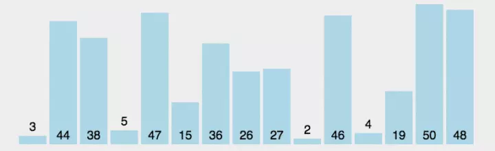

# 选择排序

> 最稳定的排序，时间复杂度为O(n)。在未排序中，找到最大的值，放到起始位置。

```javaScript
function SelectSort(arr) {
    let len = arr.length
    for (let i = 0 ; i < len; i++) {
        let tmp = i
        for (let j = i; j < len; j++ ) {
            if (arr[tmp] > arr[j]) {
                tmp = j
            }
        }
        let _val = arr[tmp]
        arr[tmp] = arr[i]
        arr[i] = _val
    }
    return arr
}
```


