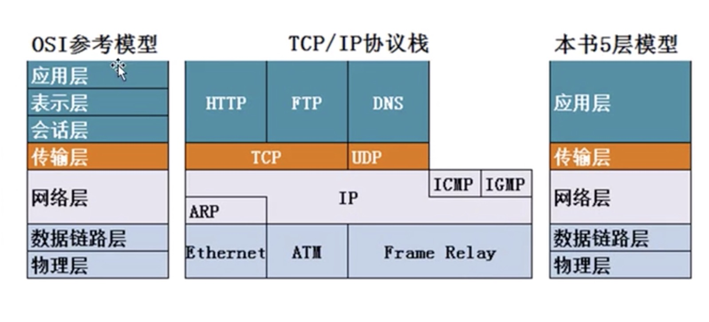
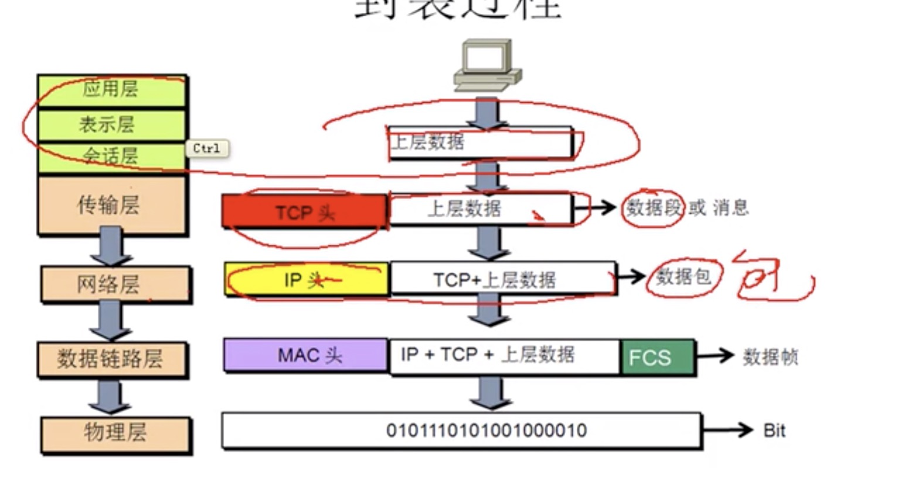
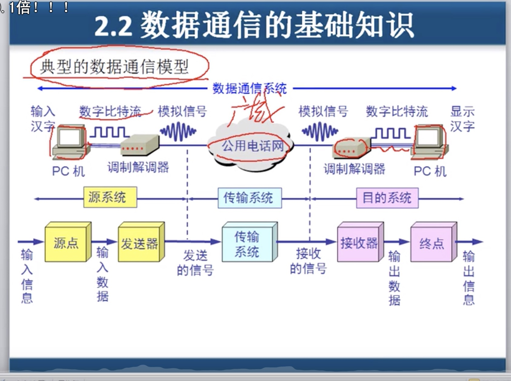

# 计算机网络概述

### 概述

局域网：覆盖范围小，自己维护、带宽固定（10m、100m、1000m）

广域网：距离远，专业服务、花钱租带宽

交换机：接入层交换机-汇聚层交换机，电脑到交换机不超过100m，交换机到另外交换机不超过100m。

ISP: 运营商

不同运营商：双机房、双线机房

internet: ISP自己机房、对网民提供网络连接

网关（一般是路由器）：负责转发数据，局域网其他机器的数据转到此并转出。掩码几个255表示ip中有前几个为网络。

网络请求发送时数据时，每个数据包包含: 数据、源ip、目标ip、源mac地址、目标mac地址。数据、源ip、目标ip称为数据包，如果再加上mac地址，就称为数据帧。在传递过程中，经过网关，会更改mac地址。

发送数据时，先放缓存，再发，发送成功后才可以删除，否则可能重发。接收数据时，也有缓存，

### OSI模型

应用层：能产生流量的程序。

表示层：在传输中是否进行加密或者压缩

会话层：来确保传输的数据时针对的请求

传输层：可靠传输、流量控制。（查询dns时，是udp通讯，是不可靠传输）

网络层：负责选择最佳路径、规划ip地址——》配置错误ip地址、子网掩码、错误网关

数据链层：帧的开始与结束、透明传输、差错校验——》mac地址冲突、ADSL、网络速度协定

物理层：定义网络设备标准、电器标准——》查看连接状态、发送接收数据包

### 性能

速率：信道中速度。

带宽：最高支持。

吞吐量：总共大小。

时延：发送时延（数据块大小/信道带宽）、传播时延、处理时延、排队时延。

时延带宽积：传播时延*带宽。

往返时间

利用率——网络利用率（信道利用率加权平均值）、信道利用率（有数据时间/总时间）

Bite: 位

1字节等于8位，8B。常说的带宽大小单位是位。

### 物理层

确定传输媒体的特性：机械特性、电气特性、功能特性、过程特性。

数据通信：

通信为了传输数据。数据——运送消息的实体。信号是数据的电气或者电磁的表现（模拟信号：取值是连续的，数字信号：取值是跳跃的）。码元：基本波形。1码元可以携带nbit信息量。

信道：单向通信、双向交替通信（半双工通信）、双向同时通信（全双工通信）。

基带信号：来源信源的信号，距离近时计算机都采用几袋信号（显示器、打印机）。

带通信号：基带信号经过调制（调幅、调频、调相），长距离使用。

常用编码：单极性不归零码、双极性不归零码、单极性归零码、双极性归零码、曼彻斯特编码（能携带时钟信号，区分是否传输信号）、差分曼彻斯特编码。

奈氏原则：理想情况下，码元的传输速率有上限。

信噪比：香农理论表示信道比（功率与干扰信号的比值）越大，传输的速率可以越大。

导向传出媒体：双绞线（屏蔽双绞线、无屏蔽双绞线）、同轴电缆（50欧姆同轴电缆——用于基带传输，也叫基带同轴电缆，75欧姆同轴电缆——用于模拟传输，也叫宽带同轴电缆）、光缆

网线：直通线顺序用于主机路由器到交互机集换器——白橙、橙、白绿、蓝、白蓝、绿、白棕、棕。交叉线用于主机到主机类的连接。

光纤：多模光纤与单模光纤（有线电视，带宽高

非导向传输媒体：无线传输。

集线器：放大增强网络信号。

信道复用：频分复用、时分复用、统计时分复用、波分复用

脉码调制有T1(24路时分复用)与E1（32路信道时分复用）标准。

宽带接入：ADSL——利用电话线（采用DMT频分技术，把40khz-1.1mhz中的25个子信道为上传，249个子信道为下载。40khz以下是电话用）、HFC——有线电视线。
