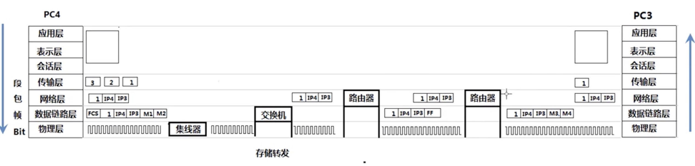
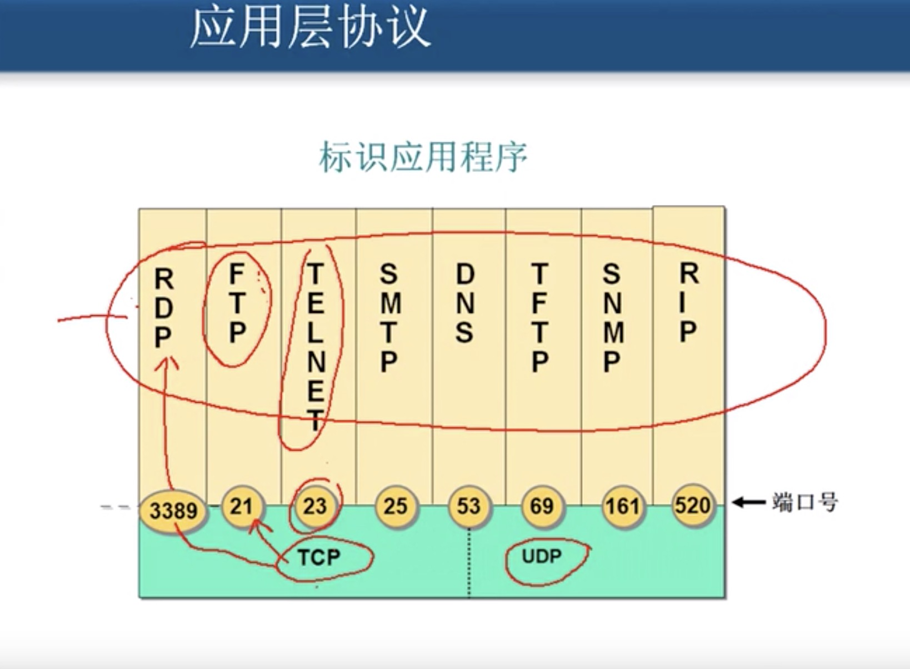
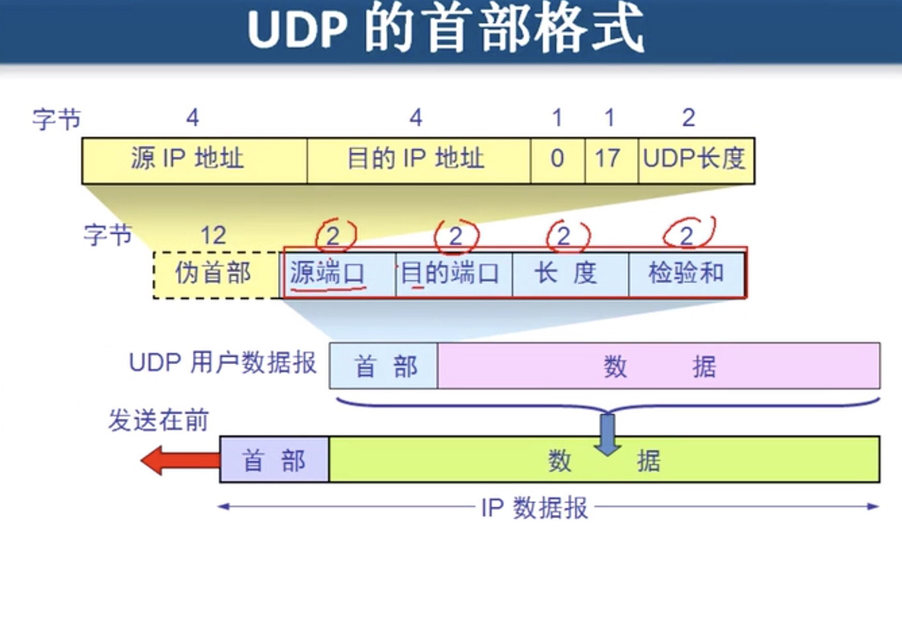
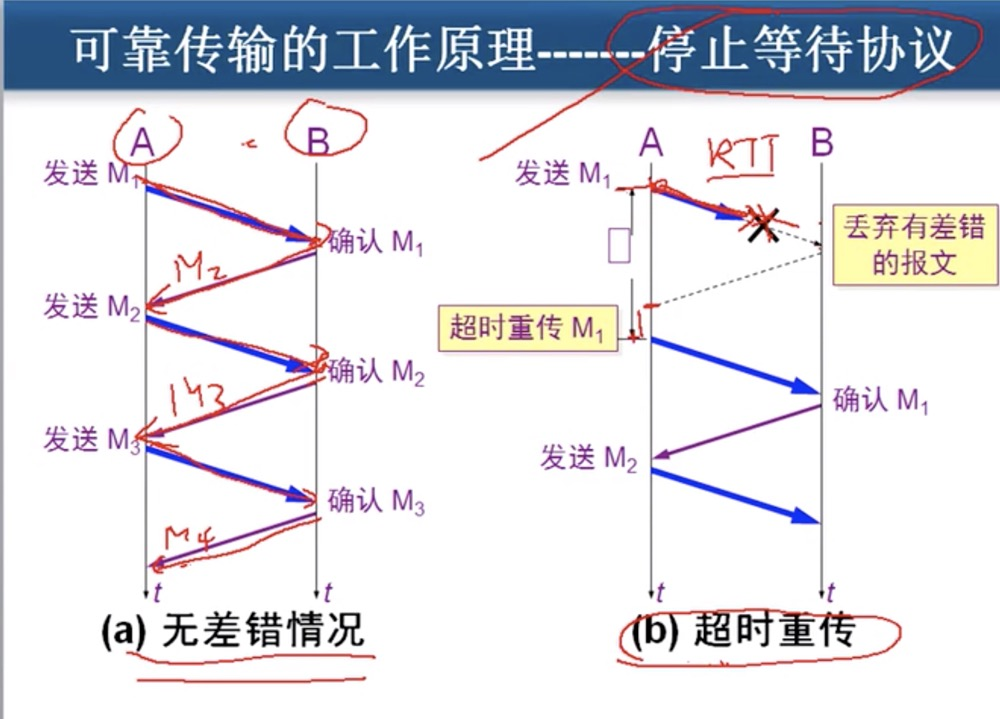
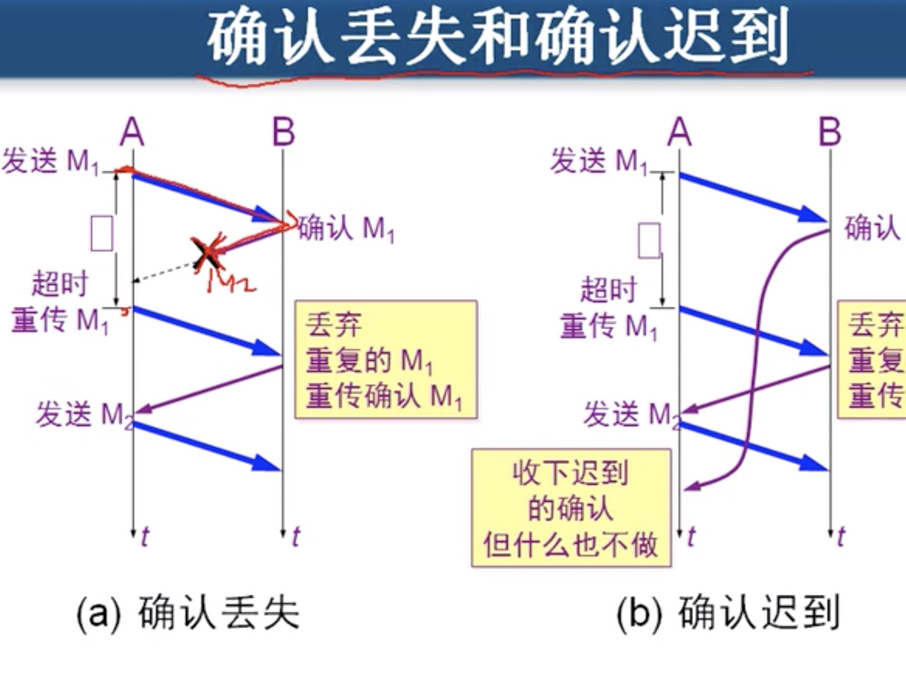
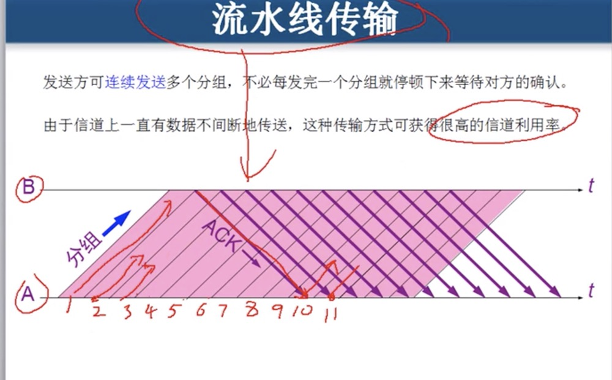
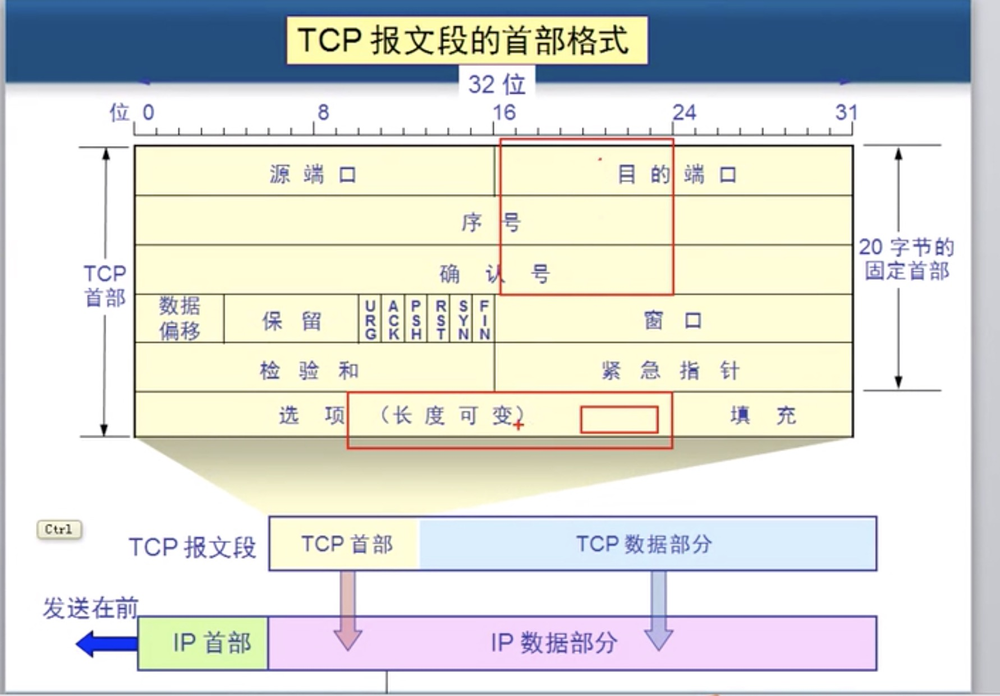
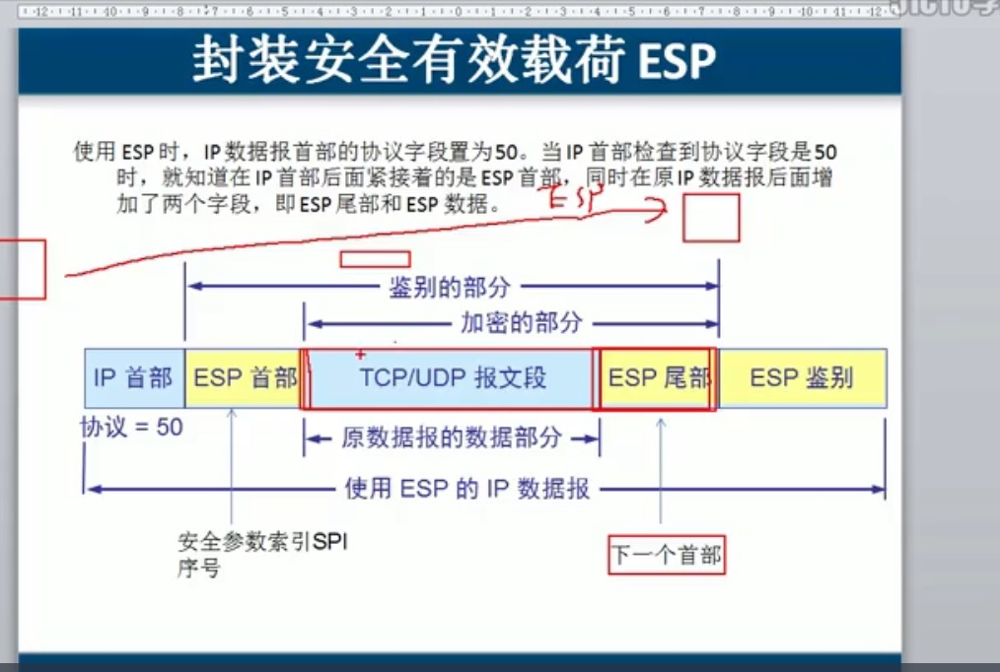
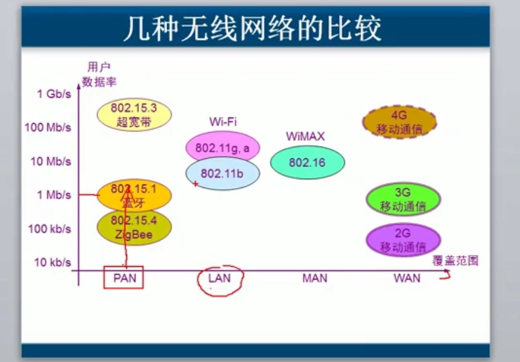

# 计算机网络概述

### 概述

局域网：覆盖范围小，自己维护、带宽固定（10m、100m、1000m）

广域网：距离远，专业服务、花钱租带宽

交换机：接入层交换机-汇聚层交换机，电脑到交换机不超过100m，交换机到另外交换机不超过100m。

ISP: 运营商

不同运营商：双机房、双线机房

internet: ISP自己机房、对网民提供网络连接

网关（一般是路由器）：负责转发数据，局域网其他机器的数据转到此并转出。掩码几个255表示ip中有前几个为网络。

网络请求发送时数据时，每个数据包包含: 数据、源ip、目标ip、源mac地址、目标mac地址。数据、源ip、目标ip称为数据包，如果再加上mac地址，就称为数据帧。在传递过程中，经过网关，会更改mac地址。

发送数据时，先放缓存，再发，发送成功后才可以删除，否则可能重发。接收数据时，也有缓存，

### OSI模型

应用层：能产生流量的程序。

表示层：在传输中是否进行加密或者压缩

会话层：来确保传输的数据时针对的请求

传输层：可靠传输、流量控制。（查询dns时，是udp通讯，是不可靠传输）

网络层：负责选择最佳路径、规划ip地址——》配置错误ip地址、子网掩码、错误网关

数据链层：帧的开始与结束、透明传输、差错校验——》mac地址冲突、ADSL、网络速度协定

物理层：定义网络设备标准、电器标准——》查看连接状态、发送接收数据包

### 性能

速率：信道中速度。

带宽：最高支持。

吞吐量：总共大小。

时延：发送时延（数据块大小/信道带宽）、传播时延、处理时延、排队时延。

时延带宽积：传播时延*带宽。

往返时间

利用率——网络利用率（信道利用率加权平均值）、信道利用率（有数据时间/总时间）

Bite: 位

1字节等于8位，8B。常说的带宽大小单位是位。

### 物理层

确定传输媒体的特性：机械特性、电气特性、功能特性、过程特性。

数据通信：

通信为了传输数据。数据——运送消息的实体。信号是数据的电气或者电磁的表现（模拟信号：取值是连续的，数字信号：取值是跳跃的）。码元：基本波形。1码元可以携带nbit信息量。

信道：单向通信、双向交替通信（半双工通信）、双向同时通信（全双工通信）。

基带信号：来源信源的信号，距离近时计算机都采用几袋信号（显示器、打印机）。

带通信号：基带信号经过调制（调幅、调频、调相），长距离使用。

常用编码：单极性不归零码、双极性不归零码、单极性归零码、双极性归零码、曼彻斯特编码（能携带时钟信号，区分是否传输信号）、差分曼彻斯特编码。

奈氏原则：理想情况下，码元的传输速率有上限。

信噪比：香农理论表示信道比（功率与干扰信号的比值）越大，传输的速率可以越大。

导向传出媒体：双绞线（屏蔽双绞线、无屏蔽双绞线）、同轴电缆（50欧姆同轴电缆——用于基带传输，也叫基带同轴电缆，75欧姆同轴电缆——用于模拟传输，也叫宽带同轴电缆）、光缆

网线：直通线顺序用于主机路由器到交互机集换器——白橙、橙、白绿、蓝、白蓝、绿、白棕、棕。交叉线用于主机到主机类的连接。

光纤：多模光纤与单模光纤（有线电视，带宽高

非导向传输媒体：无线传输。

集线器：放大增强网络信号。

信道复用：频分复用、时分复用、统计时分复用、波分复用

脉码调制有T1(24路时分复用)与E1（32路信道时分复用）标准。

宽带接入：ADSL——利用电话线（采用DMT频分技术，把40khz-1.1mhz中的25个子信道为上传，249个子信道为下载。40khz以下是电话用）、HFC——有线电视线。

### 数据链层

数据链信道：点对点信道、广播信道。

数据链层传输的是帧，是把数据加上数据头、校验值与数据尾。

数据链路层：

1，封装成帧：就是加上帧头、帧尾

2，透明传输：如果帧中有类似帧尾的数据，为插入字符来区分。解析时去掉插入的字符。

3，差错检测：（循环冗余检测）

PPP协议，是属于点到点通信，用于广域网。除了以上特性，还支持多网络协议、多类型链路，不具纠错、流量控制功能。

    用于同步或者异步串行介质

    建立链路连接

    多种网络协议

局域网现在都是集线结构，还有总线（不安全）、环形等。

碰撞监测、争用期。碰撞监测使传输效率低于以太网效率。

CSMA协议用于广播通信。

以太网：只要满足载波监听冲突访问即是。使用集线器来组件，是星型结构。到集线器的距离不超100m。

MAC地址，前24位是厂家。

MAC帧：目标MAC地址、源MAC地址、类型、数据、FCS（结束）

扩展以太网：集线器可以增加计算机数量，但是冲突域会扩大。通过网桥来解决（隔离冲突域），网桥变成交换机（直接接计算机），交换机独享带宽、学习mac地址、安全。

高速以太网，大于100m

### 网络层

网络层是在尽力转发数据包，不保证数据完整、顺序（传输层），数据包是分开转发的，可以负载。

子网掩码255的个数就是告诉计算机网络部分是多少。比如子网掩码为255.255.0.0，那么192.168.1.1的192.168就是网部分。

通过子网掩码来判断自己处于网段、对方处于网段，如果同一网站，则使用arp协议广播解析对方mac地址。如果不是同一网段，则发给路由器，

交换机是二层设备是指在链路层通过比特流读取mac地址。路由器是三层设备是获取数据包的ip地址，包括源地址与目标地址。再重新封装数据帧。

ARP协议是通信前的工作，位于ip协议工作前，只能解析本网段。

ICMP/IGMP协议用于检测网络故障，比如ping命令是ICMP。TTL的值为生存周期，表示可以经过多少个路由器节点。window系统是128，lunix是64，unix是255.

ping -i 2 更改数据包的途径路由器。

点到点通信、广播通信、组播（多播）。多播比如是电视不同频道，点到点可以建立通信调整进度。

动态路由每30s会更新一次，是RIP协议。OSPF选择路径标准是带宽。

### 传输层

传输层两个协议：TCP与UDP

TCP: 建立会话、分段、可靠、流量控制.只能点对点，可以实现全双工通信。

UDP：一个数据包完成通讯，不分段、不可靠、不能流量控制、不建立会话。DNS解析、QQ文字聊天、屏幕广播。支持一对N，首部小只有8字节。

dns即可使用tcp53端口，又可使用udp53端口。但是upd居多。

SMTP是发邮件，pop2是收邮件。

ip中使用协议号来标识tcp与udp，tcp的协议号是6，udp是17，igmp是1

端口的取值范围为：0-65525.分为熟悉端口（0-1023）、登记端口（1024-49151）、客户端端口（49152-65525）、

每个ip连接有两个端点，端点是ip+端口，即是套接字。

可靠传输原理是：停止等待协议(自动重传请求ARQ)。

流水线传输，不等确认回，就一直发。

位置发送窗口，类似缓存区，大小固定，收到确认，移动窗口。

累计确认，更高效。但是如果丢失包后有收到包则不能正确反馈。

tcp每发一次报文，都有一个计时器，计时器结束未有收到确认，就重新传，重传时间略大于加权平均往返时间。

tcp流量控制是通过调整窗口大小来确定的。

### 应用层

域名：

根域名是“.”， 顶级域名com/cn/...，二级域名baidu/jd

nslookup来确认dns解析服务商

DHCP服务器动态分配ip。分配的ip具有一定期限，如过期未续约，则回收。可以跨网段分配（ip helper-address）。

FTP使用两个tcp链接，一个控制连接（21端口），一个传输连接——主动模式，服务端从20端口向客户端发起连接；被动模式在范围内的端口等待客户端发起连接。

### 网络安全

中断、截获、伪造、篡改

网络层安全-IPsec——SA（安全关联）

数据链路层安全——身份证验证（ADSL拨号）、PPP协议身份验证、防火墙

### 无线局域网

视频分为：流式音视频（边下载边播放）、流式实况视频（边录边播比发送）、交互式音视频
